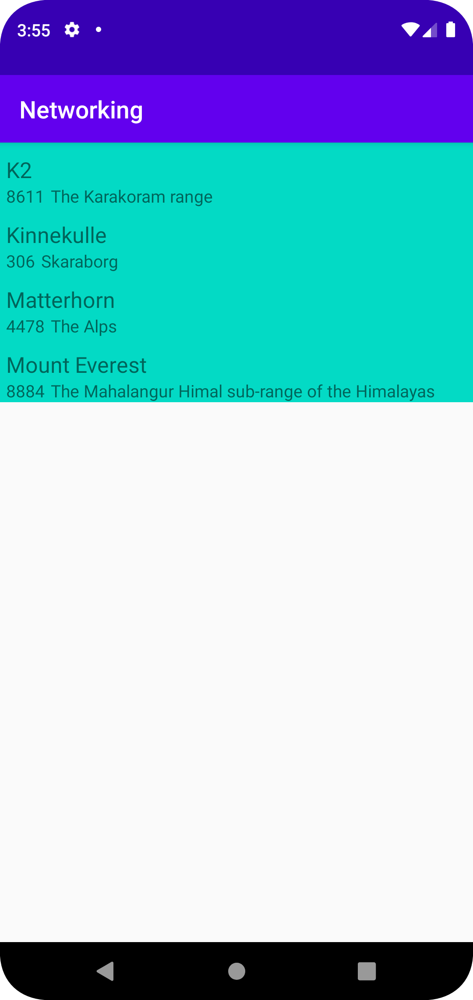

# Rapport

Uppgiften innefattade att hämta Json-data från en hemsida, parsa datan via gson för att slutligen visa datan i en recycleView.

I MainActivity hämtas först json-datan från hemsidan och sparas i en variabel samt att en adapter, recyclerView och en tom lista vid namn listOfMountains deklareras.
Variabeln recyclerView kopplas ocskå till recyclerViewens:s ID i aktiviteten.
```
protected void onCreate(Bundle savedInstanceState) {
    super.onCreate(savedInstanceState);
    setContentView(R.layout.activity_main);
    listOfMountains = new ArrayList<Mountain>();
    adapter = new MountainAdapter(listOfMountains);

    recyclerView = findViewById(R.id.my_recycler);
    recyclerView.setLayoutManager(new LinearLayoutManager(this));
    recyclerView.setAdapter(adapter);

    new JsonTask(this).execute(JSON_URL);
}
```

Vi ber också JSON-datan från hemsidan parsas i onPostExecute med hjälp av gson.
Variabeln listOfMountains tilldelas då informationen från den parsade gson-datan som skickas vidare till adaptern.
```
public void onPostExecute(String json) {
    Gson gson = new Gson();
    Type type = new TypeToken<ArrayList<Mountain>>() {}.getType();
    listOfMountains = gson.fromJson(json, type);
    adapter.setMountains(listOfMountains);
    adapter.notifyDataSetChanged();
    Log.d(TAG, json);
}
```

I adaptern MountainAdapter binder vi sedan datan från ett Mountain-objekt i vår lista till viewHoldern samt hämtar storleken på listan.
I ViewHoldern kopplas variablerna till ID:et på de TextViews som finns i recyclerViewens ItemView.
```
public void onBindViewHolder(@NonNull MountainViewHolder holder, int position) {
    Mountain mountain = mountains.get(position);

    holder.name.setText(mountain.getName());
    holder.location.setText(mountain.getLocation());
    holder.height.setText(String.valueOf(mountain.getHeight()));
}

public int getItemCount() {
    return mountains.size();
}
```
Nedan finns en screenshot på recyclerViwen med data.


